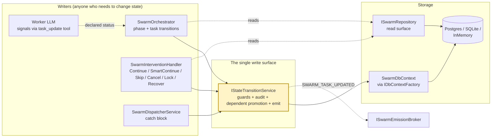

# Swarm State Machine

Every swarm run is driven by two state machines: one for the **swarm instance**
(`Created → Planning → … → Complete/Failed/Cancelled`) and one for each **task**
(`Blocked/Pending → InProgress → Completed/Failed`). Both enums live in the
`Swarmwright.Models.Enums` namespace and are enforced by a single write surface,
`IStateTransitionService`, which is the only code path that writes to
`SwarmEntity.State` or `TaskEntity.State` in the database.

The single-write-surface design replaces the naive alternative where several
services write to the DB directly with no guard against illegal transitions and
no audit trail. In Swarmwright there is **no in-memory task cache**: every task
read goes straight to `ISwarmRepository`, every task write goes through
`IStateTransitionService.TransitionTaskAsync`, and dependent promotion
(`Blocked → Pending`) is handled inside that same call — atomically with the
completing task's own transition.

## Documents in this section

| Doc | Purpose |
| --- | --- |
| [state-swarm-instances.md](state-swarm-instances.md) | The `SwarmInstanceState` enum — every legal transition, when each transition fires, and the reason strings recorded on the audit trail. |
| [state-task.md](state-task.md) | The `TaskState` enum — legal transitions, the orchestrator's per-round lifecycle, and how dependency resolution promotes `Blocked → Pending`. |

## Core components



> **How to read the arrows.** Solid arrows are writes; they all funnel through
> `IStateTransitionService`. The state service opens its own `SwarmDbContext`
> (via `IDbContextFactory`) and commits the state mutation, the audit row, and —
> when a task lands on a terminal state — the dependent promotions in one
> `SaveChanges`. The worker never writes state: its `task_update` tool only
> *signals* a declared status back to the orchestrator, which then performs the
> real DB write. Reads go through `ISwarmRepository` (dotted); there is no
> in-memory task board to fall out of sync.

### Responsibilities

- **`IStateTransitionService`** — the only code path that writes
  `SwarmEntity.State` or `TaskEntity.State`. Reads the current state, consults
  `SwarmStateGuards`, rejects illegal transitions with
  `InvalidStateTransitionException`, and writes the new state plus a transition
  audit row in the same EF `SaveChanges`. When a task lands on `Completed` **or**
  `Failed`, the same call strips the task's id from every dependent's
  `blocked_by` list and promotes any dependent whose list is now empty from
  `Blocked` to `Pending` — all in the one transaction. Every successful task
  transition then emits `SWARM_TASK_UPDATED` via `ISwarmEmissionBroker` (once,
  post-commit); a broker failure is logged and does not roll back the persisted
  transition. Swarm transitions additionally signal `ISwarmObservationSink` so
  workflow consumers awaiting a state change wake. Pure state machine, no
  business logic.
- **`SwarmService`** — coordinates the runtime-only collaborators (inbox system,
  team registry, agent roster) and exposes a **read** surface over
  `ISwarmRepository` (`GetTasksAsync`, `GetRunnableTasksAsync`,
  `GetPersistedStateAsync`). It does **not** write task or swarm state — there is
  no `UpdateTaskStatusAsync`. Dependent promotion is owned entirely by the state
  service, not by `SwarmService`.
- **`SwarmOrchestrator`** — drives phase advancement
  (`Planning → Spawning → Executing → Synthesizing → Complete`) and per-task
  lifecycle (`Pending → InProgress → Completed/Failed`). It reads the declared
  status the worker signalled via `task_update`
  (`TaskExecutionResult.WorkerDeclaredStatus`) and calls the state service
  directly for both its own phase transitions and each task's terminal write.
- **Intervention endpoints** (`/continue`, `/smart-continue`, `/skip`,
  `/cancel`, `/lock`, `/unlock`, `/mark-as-awaiting-intervention`) — routed
  through `SwarmInterventionHandler`, which writes user-driven transitions
  (`AwaitingIntervention → Executing`, `→ Synthesizing`, `→ Cancelled`,
  `Failed → AwaitingIntervention`) via the state service.
- **`SwarmDispatcherService`** — creates the swarm row in the DB **before** the
  orchestrator runs (so a pre-Planning failure has a row to attach a transition
  to), and in its catch block fails any orphaned `InProgress` tasks and records
  the `Failed` swarm transition when an exception fires before the orchestrator
  can (e.g. a template-load error in `BuildOrchestrator`).

### Why a single write surface

Routing every state write through one guarded, audited method rules out three
classes of failure that a "let each service write the DB directly" design
invites:

1. **Divergence.** Promoting a dependent `Blocked → Pending` in one place while
   the completing task's write happens in another leaves a window where the two
   can disagree — a dependent unblocked in memory but still `Blocked` in the DB,
   whose next `Blocked → InProgress` the guard then rejects. Swarmwright closes
   the window by running `PromoteDependentsAsync` **inside**
   `TransitionTaskAsync`, so the completion and every dependent promotion commit
   in a single `SaveChanges`.
2. **No audit.** Without a transition log, "why did this swarm fail?" can only be
   answered by correlating logs on timestamps. The `swarm_state_transitions` and
   `task_state_transitions` tables now record `from_state`, `to_state`,
   `reason`, `actor`, `note`, and `created_at` for every write (task rows also
   carry `task_id` and a `retry_count_after` snapshot).
3. **Illegal states.** A design that lets any caller write any value would allow,
   for example, `Completed → Pending` on every Continue click, silently resetting
   terminal work with no retry budget. The guard rejects that; retries go through
   the explicit `Failed → Pending` path with a `retry_count` delta.

## End-to-end state write sequence

The most important flow: a task completes, its dependents unblock, and the next
round picks them up. In Swarmwright the completion and the dependent promotions
are a single atomic transition, so there is no in-memory/DB divergence window.

```mermaid
sequenceDiagram
    autonumber
    participant Worker as Worker LLM
    participant Tool as task_update tool
    participant Orch as SwarmOrchestrator
    participant State as IStateTransitionService
    participant Ctx as SwarmDbContext (EF)
    participant DB as Database
    participant Broker as ISwarmEmissionBroker

    Note over Orch,DB: Round N — task A is Pending, picked up
    Orch->>State: TransitionTaskAsync(A, InProgress, phase_advanced)
    State->>Ctx: read A
    Ctx->>DB: SELECT
    DB-->>Ctx: A (Pending)
    State->>State: guard: Pending -> InProgress ✓
    State->>Ctx: A = InProgress + audit row
    Ctx->>DB: SaveChanges (UPDATE + INSERT)
    State->>Broker: EmitTaskUpdatedAsync(A, InProgress)

    Orch->>Worker: ExecuteTaskAsync(A)
    Worker->>Tool: task_update(A, Completed, result)
    Tool-->>Worker: {success} — signal only, no DB write
    Worker-->>Orch: WorkerDeclaredStatus = Completed, result

    Note over Orch,DB: Completion + dependent promotion in ONE transaction
    Orch->>State: TransitionTaskAsync(A, Completed, phase_advanced, result)
    State->>Ctx: read A
    Ctx->>DB: SELECT
    DB-->>Ctx: A (InProgress)
    State->>State: guard: InProgress -> Completed ✓
    State->>Ctx: A = Completed (+ result) + audit row
    State->>State: PromoteDependentsAsync(A):<br/>strip A from siblings' blocked_by;<br/>B now empty & Blocked -> Pending + audit row
    State->>Ctx: B = Pending, B.blocked_by = []
    Ctx->>DB: SaveChanges (A completion + B promotion commit together)
    State->>Broker: EmitTaskUpdatedAsync(A, Completed)
    State->>Broker: EmitTaskUpdatedAsync(B, Pending)

    Note over Orch,DB: Round N+1 — next runnable task
    Orch->>State: GetRunnableTasksAsync -> [B (Pending)]
    Orch->>State: TransitionTaskAsync(B, InProgress, phase_advanced)
    State->>Ctx: read B
    Ctx->>DB: SELECT
    DB-->>Ctx: B (Pending) ✓
    Note right of State: guard passes because B's promotion<br/>committed atomically with A's completion
    State->>Ctx: B = InProgress + audit row
    Ctx->>DB: SaveChanges
    State->>Broker: EmitTaskUpdatedAsync(B, InProgress)
```

### What the diagram proves

1. **Every DB state write goes through `IStateTransitionService`.** No direct
   `context.Tasks.Update(…)` from a caller, no repository state write. One
   surface, one guard check, one audit row, and one `SWARM_TASK_UPDATED`
   emission per transition.
2. **Completion and dependent promotion are atomic.** `PromoteDependentsAsync`
   runs inside `TransitionTaskAsync` whenever a task lands on `Completed` or
   `Failed`; the stripped `blocked_by` lists, the promotion `Blocked → Pending`,
   and the completing task's own row all commit in one `SaveChanges`. A dependent
   can never be unblocked in memory but stranded `Blocked` in the DB — that class
   of bug is impossible by construction. (`Failed` promotes dependents for the
   same reason `Completed` does: without it, downstream tasks would stay
   `Blocked` forever and the swarm would deadlock.)
3. **The worker's `task_update` tool is signal-only.** It validates and echoes
   the declared status back to the model, but writes nothing. The orchestrator
   parses the declared status out of the worker's turn and performs the single
   authoritative write — so there is no double-write race against the state
   service.
4. **The guard catches drift.** If a promotion had somehow not committed, round
   N+1's `Pending → InProgress` read would see DB state `Blocked` and the guard
   would throw. The guard is the safety net that makes silent divergence
   impossible to reintroduce.

## Invariants enforced by the guards

- **Task transitions are not arbitrary.** `Blocked → InProgress` is illegal; the
  state machine demands `Blocked → Pending → InProgress` so the dependency-
  resolution step runs first. (`Blocked → {Pending, Failed}`.)
- **Terminal is terminal for tasks.** `Completed` has no outbound transitions. A
  Continue on an intervening swarm resets only `Failed` tasks
  (`Failed → Pending`) with a `retry_count` delta of `+1`; `Completed` tasks are
  never touched.
- **Orphan recovery is explicit.** `InProgress → Pending` is legal only via the
  `orphan_resume` path — the crash-recovery reset for a task left in-flight by a
  crashed run. `retry_count` is left unchanged because the worker never got to
  run, so it is not a budget charge.
- **Feedback pauses are recoverable.** A task can pause
  `InProgress → AwaitingFeedback` and later resume `AwaitingFeedback → InProgress`
  (or fail) once the user answers.
- **Swarm recovery has budget.** `AwaitingIntervention` can return to
  `Executing`, force `Synthesizing`, escalate to `NeedsDiagnosis`, or be
  `Cancelled`. `NeedsDiagnosis` can still return to `Executing` via Smart
  Continue (leader repair), but plain Continue is rejected — the operator is out
  of retry budget.
- **Failure is recordable and recoverable.** `Created → Failed` is legal so the
  dispatcher can record pre-Planning failures like template-load errors. `Failed`
  is terminal for normal flow (every standard intervention endpoint returns
  410 Gone), but the Manual Recover action
  (`/mark-as-awaiting-intervention`) walks `Failed → AwaitingIntervention` so a
  transient infrastructure error captured by the orchestrator's catch-all is not
  stranded forever.

## Guard implementation

Both the `SwarmInstanceState` and `TaskState` transition tables live as
`Dictionary<TState, HashSet<TState>>` in
[SwarmStateGuards.cs](../src/Swarmwright/Hosting/StateMachine/SwarmStateGuards.cs).
Reading the code is the authoritative source — the child docs mirror the tables
in diagram form for scanability, but the guard is the only thing that actually
stops an illegal transition. The single write surface that consults it is
[IStateTransitionService.cs](../src/Swarmwright/Hosting/StateMachine/IStateTransitionService.cs)
/ [StateTransitionService.cs](../src/Swarmwright/Hosting/StateMachine/StateTransitionService.cs),
and the canonical reason labels recorded on every audit row are in
[TransitionReasons.cs](../src/Swarmwright/Hosting/StateMachine/TransitionReasons.cs).

See [state-swarm-instances.md](state-swarm-instances.md) and
[state-task.md](state-task.md) for the per-state transition diagrams.

## Cross-references

- [swarm.md](swarm.md) — HTTP endpoints for driving swarm state from outside
  (create, continue, skip, cancel).
- [admin.md](admin.md) — the admin SPA reads the state machine via
  SSE and renders the recovery surface.
- [resilience.md](resilience.md) — orphan recovery and self-healing
  behind the `orphan_resume` and dispatcher cleanup paths.
- [mcp-server.md](mcp-server.md) — external agents can also drive
  state via the MCP server.
