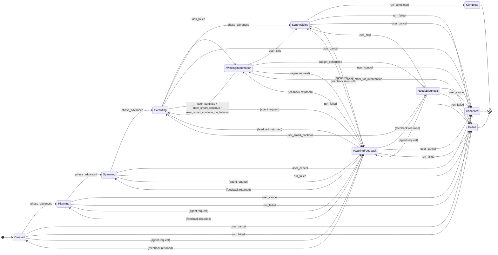

# Swarm Instance State

The `SwarmInstanceState` enum tracks a whole swarm's lifecycle. It lives in [Models/Enums/SwarmInstanceState.cs](../src/Swarmwright/Models/Enums/SwarmInstanceState.cs) and is enforced by [SwarmStateGuards.cs](../src/Swarmwright/Hosting/StateMachine/SwarmStateGuards.cs). The DB column is `SwarmEntity.State` (string form of the enum).

For the overall architecture of writes, see [state-machine.md](state-machine.md).

## States

| State | Meaning |
| --- | --- |
| `Created` | Row exists in DB; the dispatcher has not started the orchestrator yet, or the orchestrator is inside `RunAsync` before the first state write. |
| `Planning` | Leader LLM is producing a task plan via the `create_plan` tool. |
| `Spawning` | Orchestrator is instantiating the worker agents declared in the plan. |
| `Executing` | Workers are running tasks in rounds; the task-board readiness scan promotes deps as they complete. |
| `AwaitingIntervention` | A task failed and the swarm paused. Recovery budget still remains, so Continue / Smart Continue / Force Synthesis are all offered. |
| `NeedsDiagnosis` | Recovery budget exhausted. Continue is disabled; Smart Continue (leader intervention) and Force Synthesis are the only forward options. |
| `AwaitingFeedback` | An agent invoked a feedback-request tool mid-flight. No current producer transitions the swarm into this state — the enum value and its guard edges exist, but nothing writes the swarm-level transition yet (feature stub). |
| `Synthesizing` | Leader LLM is building the final report via the `submit_report` tool. |
| `Complete` | Terminal. Report is persisted, files are committed to the workdir. |
| `Cancelled` | Terminal. User cancelled or the host shut down mid-run. |
| `Failed` | Terminal in the normal-flow sense — `IsTerminal(Failed)` is true and every standard intervention endpoint returns 410 Gone. The one exception is the admin **Manual Recover** action, which can reopen a `Failed` swarm into `AwaitingIntervention` (see below). The audit row's `note` holds the exception message. |

## Transition diagram

The Mermaid source mirrors the `SwarmTransitions` dictionary in [SwarmStateGuards.cs](../src/Swarmwright/Hosting/StateMachine/SwarmStateGuards.cs). If the code ever disagrees with the diagram, the code wins — open a PR to update the diagram.

The lone edge out of a terminal state — `Failed → AwaitingIntervention` — is intentional. `Failed` is still terminal for every standard intervention endpoint, but the admin **Manual Recover** action deliberately bypasses that rule so transient errors (infrastructure failures captured by `SwarmOrchestrator.RunAsync`'s catch-all) can be walked back to the intervention decision table rather than stranding real work forever.

## Reason strings

Every transition writes a row to `swarm_state_transitions` with a canonical reason string. The full set lives in [TransitionReasons.cs](../src/Swarmwright/Hosting/StateMachine/TransitionReasons.cs):

| Reason | Fires on |
| --- | --- |
| `phase_advanced` | Normal orchestrator progression (`Planning → Spawning`, etc.). |
| `task_failed` | Orchestrator routed to its task-failure handler and suspended the swarm. |
| `user_continue` | `POST /api/swarm/{id}/continue` — retry budget consumed. |
| `user_smart_continue` | `POST /api/swarm/{id}/smart-continue` — leader's `repair_plan_after_failure` tool ran. |
| `user_smart_continue_no_failures` | `POST /api/swarm/{id}/smart-continue` on a swarm with zero failed tasks. The handler short-circuits: it does NOT invoke the leader advisor (there's nothing to repair) and transitions straight to `Executing`. See [resilience.md](resilience.md). |
| `auto_smart_continue` | Reserved label. Defined in `TransitionReasons` but no code path currently emits it; the `Swarmwright.Workflows` programmatic auto-continue executor drives the standard Smart Continue path (which emits `user_smart_continue`) instead. |
| `orphan_resume` | A task-level reason. Continue reset an orphan `InProgress` task (left over from a crashed orchestrator run) back to `Pending` **without** charging retry budget. Distinct from `user_continue` so audit filters can separate crash-cleanup resets from operator-driven retries. |
| `leader_repair_plan` | A task-level reason: a specific task was flipped `Failed → Pending` by the leader's repair plan. Not the swarm-level transition itself. |
| `abandoned_dep_stripped` | A task-level reason: a surviving task was promoted `Blocked → Pending` after the leader abandoned an upstream dependency; `retry_count` is unchanged. |
| `budget_exhausted` | Orchestrator counted `retry_count >= MaxTaskRetries` across failed tasks and escalated to `NeedsDiagnosis`. |
| `user_skip` | Force Synthesis button: jump straight to `Synthesizing`. |
| `user_cancel` | Cancel button / `POST /cancel` / orchestrator caught `OperationCanceledException`. |
| `user_mark_for_intervention` | Manual Recover: `POST /api/swarm/{id}/mark-as-awaiting-intervention` flipped a `Failed` swarm to `AwaitingIntervention`. A pure state transition — it does not resume the orchestrator. |
| `run_started` | Not currently emitted on the swarm transition table (the orchestrator uses `phase_advanced` on the first `Created → Planning` write). Label is defined for future use. |
| `run_completed` | Orchestrator finished `SynthesizeAsync` and wrote `Synthesizing → Complete`. |
| `run_failed` | Catch-all for unhandled exceptions, including the dispatcher's pre-Planning failures (template load errors). |
| `lock_acquired` / `lock_released` / `lock_stolen` / `lock_expired` | Diagnose-lock audit rows. Not state transitions — these use `RecordSwarmAuditAsync` on the same table. |

## Where each transition is written

Every row in `swarm_state_transitions` was written by exactly one of three actors: the orchestrator (normal phase advancement, failure detection, and skip-signal), an intervention endpoint (user-driven recovery), or the dispatcher (pre-Planning failures). The table below maps every legal transition to its writer so operators can triage "who moved this swarm" from the audit trail alone.

| Writer | Transition | Reason | Fires when |
| --- | --- | --- | --- |
| `SwarmOrchestrator` | `Created → Planning` | `phase_advanced` | `RunAsync` enters `PlanAsync`. |
| `SwarmOrchestrator` | `Planning → Spawning` | `phase_advanced` | Leader's `create_plan` tool returned; tasks are persisted. |
| `SwarmOrchestrator` | `Spawning → Executing` | `phase_advanced` | All workers instantiated; ready for round 1. |
| `SwarmOrchestrator` | `Executing → AwaitingIntervention` | `task_failed` | A task failed and the orchestrator suspended the loop. |
| `SwarmOrchestrator` | `AwaitingIntervention → NeedsDiagnosis` | `budget_exhausted` | `retry_count >= MaxTaskRetries` across failed tasks. |
| `SwarmOrchestrator` | `Executing → Synthesizing` | `phase_advanced` | All tasks terminal; normal forward progression. |
| `SwarmOrchestrator` | `Synthesizing → Complete` | `run_completed` | `SynthesizeAsync` produced the final report. |
| `SwarmOrchestrator` | any → `Cancelled` | `user_cancel` | Catch block caught `OperationCanceledException` with the cancellation flag set. |
| `SwarmOrchestrator` | any → `Failed` | `run_failed` | Catch block caught an unhandled exception mid-run. |
| `POST /continue` | `AwaitingIntervention → Executing` | `user_continue` | User clicked Continue. Accepts when **any** of three is true: a Failed task has retry budget (budget consumed, `retry_count++`), a Pending task is already viable (no budget consumed — the orchestrator just needs to re-enter the round loop), or an orphan `InProgress` task exists (reset to `Pending` via `orphan_resume`, no budget consumed). Rejects with 409 `no_retry_budget` only when none of the three is true. |
| `POST /smart-continue` | `AwaitingIntervention → Executing` | `user_smart_continue` | Leader's `repair_plan_after_failure` produced a plan. |
| `POST /smart-continue` | `AwaitingIntervention → Executing` | `user_smart_continue_no_failures` | Swarm had zero failed tasks but viable Pending/Blocked work. Handler short-circuits, skipping the advisor entirely. |
| `POST /smart-continue` | `NeedsDiagnosis → Executing` | `user_smart_continue` | Same, but after budget exhaustion — editorial retry. |
| `POST /skip` | `AwaitingIntervention → Synthesizing` | `user_skip` | Force Synthesis button. |
| `POST /skip` | `NeedsDiagnosis → Synthesizing` | `user_skip` | Same, from diagnosed state. |
| `POST /cancel` | any non-terminal → `Cancelled` | `user_cancel` | Cancel button; orchestrator also sees the cancellation signal. |
| `POST /mark-as-awaiting-intervention` | `Failed → AwaitingIntervention` | `user_mark_for_intervention` | Manual Recover. Valid only from `Failed`; carries the original failure note forward. Does not resume the orchestrator — the operator picks a recovery action next. |
| `SwarmDispatcherService` | `Created → Failed` | `run_failed` | Exception before the orchestrator is built (template load, DI resolution) — the orchestrator never ran, so its own catch can't fire. |

Actor stamping is consistent: orchestrator- and dispatcher-driven writes use `actor="system"`; endpoint writes use the resolved caller identity — `HttpContext.User.Identity.Name`, falling back to the `X-Swarm-Actor` header for unauthenticated dev hosts, and `null` (recorded as no actor) when neither is present. See [SwarmActorResolver.cs](../src/Swarmwright.AspNetCore/Extensions/SwarmActorResolver.cs). This lets operators filter the transition log by user.
