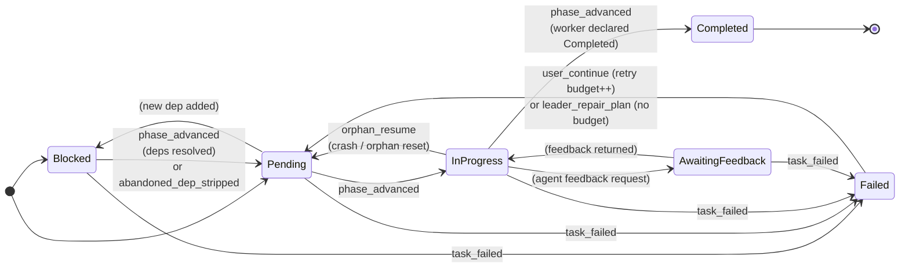
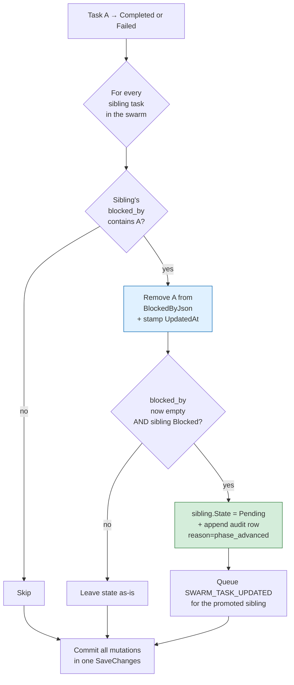
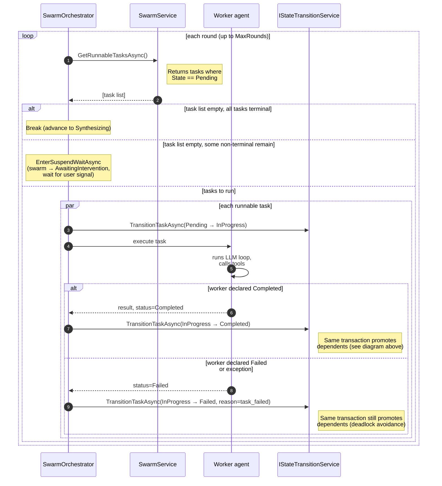

# Task State

The `TaskState` enum tracks a single task's lifecycle. It lives in [TaskState.cs](../src/Swarmwright/Models/Enums/TaskState.cs) and is enforced by [SwarmStateGuards.cs](../src/Swarmwright/Hosting/StateMachine/SwarmStateGuards.cs). The DB column is `TaskEntity.State` (string form of the enum); the in-memory form is `SwarmTask.Status`.

All task writes go through a single writer: `IStateTransitionService.TransitionTaskAsync` ([StateTransitionService.cs](../src/Swarmwright/Hosting/StateMachine/StateTransitionService.cs)). It validates the transition against the guard, mutates `TaskEntity.State`, appends an audit row, and — when the task lands on a terminal state — resolves dependencies, all inside one `SaveChanges` so they commit together. There is no in-memory task cache: reads go straight to the repository via `SwarmService.GetTasksAsync` / `GetRunnableTasksAsync`.

For the overall architecture of writes, see [state-machine.md](state-machine.md).

## States

| State | Meaning |
| --- | --- |
| `Blocked` | Task has one or more unresolved dependencies in `blocked_by`. Not runnable until they all clear. |
| `Pending` | Task is ready to be picked up by the next orchestration round. `GetRunnableTasksAsync` returns exactly the tasks in this state. |
| `InProgress` | Orchestrator dispatched a worker to execute the task; the worker is running or has returned but we haven't written the terminal transition yet. |
| `Completed` | Terminal success. The worker's `result` text is the ONLY input the synthesis phase receives from this task. |
| `Failed` | Non-terminal failure. A user Continue can flip it back to `Pending` (with `retry_count++`); the leader's repair plan can flip it without consuming budget. |
| `AwaitingFeedback` | Task paused because the worker requested feedback. No current producer writes this task state — the guard reserves the transition, but no code transitions a task into `AwaitingFeedback` today (feature stub). |

## Transition diagram

**Key invariant: `Blocked → InProgress` is NOT legal.** Every task must first be promoted to `Pending` via dependency resolution (or by the leader's abandoned-dependency strip pass) before the orchestrator can run it. The guard also rejects `Completed → InProgress`, which protects a resumed swarm from re-running already-finished work.

**`InProgress → Pending` is legal only for orphan recovery.** When an orchestrator run crashes mid-round it can strand a task at `InProgress`. A user Continue resets such orphans back to `Pending` (reason `orphan_resume`) without charging retry budget — the worker never completed, so it wasn't a budget-charged decision. The guard permits the transition; the reason string is what distinguishes it from a normal retry. See [SwarmStateGuardsOrphanResumeTests.cs](../tests/Swarmwright.Tests/Hosting/StateMachine/SwarmStateGuardsOrphanResumeTests.cs).

## Reason strings

From [TransitionReasons.cs](../src/Swarmwright/Hosting/StateMachine/TransitionReasons.cs) (task-relevant subset):

| Reason | Fires on |
| --- | --- |
| `phase_advanced` | Normal lifecycle — `Pending → InProgress`, `InProgress → Completed`. Also the reason recorded when dependency resolution promotes a dependent `Blocked → Pending`. |
| `task_failed` | Worker reported `task_update(Failed)`, the self-healing orphan sweep timed the task out, or the orchestrator caught an exception during task execution. |
| `user_continue` | A user Continue that consumed retry budget (`retry_count++`); fires `Failed → Pending`. |
| `orphan_resume` | A user Continue reset an orphan `InProgress` task back to `Pending` after a crashed run; `retry_count` is unchanged (not a budget charge). |
| `leader_repair_plan` | Smart Continue's leader reset a Failed task via its repair plan; fires `Failed → Pending` with `retry_count` unchanged (editorial retry). |
| `abandoned_dep_stripped` | A surviving `Blocked` task's blocked-by list emptied after the leader abandoned an upstream task; fires `Blocked → Pending`. |

`TransitionReasons` also carries swarm-level reasons (`run_started`, `run_completed`, `user_smart_continue`, `budget_exhausted`, the diagnose-lock reasons, etc.); those drive the swarm-instance state machine, not the task machine. See [state-swarm-instances.md](state-swarm-instances.md).

## Dependency resolution

Dependency resolution is folded into `TransitionTaskAsync`. When a task transitions to a terminal state — **`Completed` or `Failed`** — the same DB transaction runs `PromoteDependentsAsync`, which walks every sibling task in the swarm, strips the terminal task's id from the sibling's `BlockedByJson`, and promotes the sibling `Blocked → Pending` when its dependency list is now empty.

Because the strip + promotion happen in the same `SaveChanges` as the terminal transition itself, `TaskEntity.State` and `BlockedByJson` in the DB never diverge from what the next round observes — the next round's `GetRunnableTasksAsync` reads the freshly promoted rows directly. After the commit, `StateTransitionService` emits one `SWARM_TASK_UPDATED` per promoted dependent so the admin board reflects `Blocked → Pending` immediately. Verified end-to-end by [TaskPromotionDbWriteThroughTests.cs](../tests/Swarmwright.Tests/Orchestration/TaskPromotionDbWriteThroughTests.cs).

**Failed promotes dependents too.** This is deliberate: if a `Failed` task did not release its dependents, every downstream task would stay `Blocked` forever and the swarm would deadlock rather than reaching a diagnosable state. Covered by [DuplicateAndFailedDeadlockTests.cs](../tests/Swarmwright.Tests/Composition/DuplicateAndFailedDeadlockTests.cs).

### Resume preservation

`SwarmService.AddTaskAsync` ([SwarmService.cs](../src/Swarmwright/Services/SwarmService.cs)) derives a fresh task's initial status from its `BlockedBy` count: tasks with dependencies become `Blocked`, tasks without become `Pending`. That heuristic is correct for the planner creating new tasks, but it must not fire when a caller is hydrating a task whose state is already known. So the heuristic runs **only** for planning states — it skips any inbound task already in a terminal (`Completed`, `Failed`) or active (`InProgress`, `AwaitingFeedback`) state and persists that state as-is.

Without this guard, hydrating a swarm that has `Completed` tasks in the DB would silently demote them to `Pending`, the orchestrator would treat them as runnable, and the next transition would hit the `Completed → InProgress` guard rejection. The status-derivation behavior is exercised by [SwarmServiceTests.cs](../tests/Swarmwright.Tests/Services/SwarmServiceTests.cs) (`AddTaskAsync_TaskWithBlockers_PersistsAsBlocked`). For the broader resume/crash-recovery story, see [resilience.md](resilience.md).

## Per-round task lifecycle

A `Failed` task's dependents therefore become `Pending` and are runnable in the next round. The swarm only suspends to `AwaitingIntervention` when a round produces no runnable `Pending` work yet non-terminal tasks remain; from there the intervention surface (Continue / Smart Continue) decides what to retry.

## Retry semantics

- `retry_count` is a column on `TaskEntity`. Every `TransitionTaskAsync` call accepts a `retryCountDelta` that is added to the current value at write time. Audit rows store `retry_count_after` so the trail shows both the delta and the resulting count.
- **User Continue** uses `retryCountDelta: 1`. Budget is consumed; `MaxTaskRetries` (default `1`, in [SwarmOptions.cs](../src/Swarmwright/Configuration/SwarmOptions.cs)) gates whether a Failed task is still eligible for Continue.
- **Orphan resume** uses `retryCountDelta: 0`. The stranded `InProgress` worker never completed, so recovering it is not a budget charge.
- **Leader Smart Continue** (`leader_repair_plan`) uses `retryCountDelta: 0`. It's an editorial retry — the LLM's repair plan is trusted to know the right answer without spending a human's budget.
- **Abandoned-dependency strip** uses `retryCountDelta: 0`. The promoted task never failed, so it wasn't using budget to begin with.

## Cross-references

- [state-swarm-instances.md](state-swarm-instances.md) — swarm-level state machine (which drives when task-level transitions can happen).
- [state-machine.md](state-machine.md) — the architecture diagram showing how the orchestrator, `SwarmService`, and the state-transition service collaborate.
- [admin.md](admin.md) — the admin board UI that renders `TaskState` in real time over SSE.
